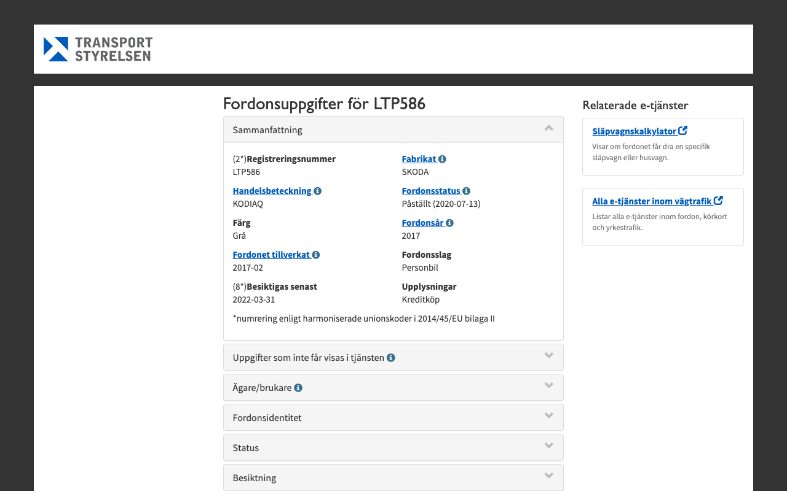

# Web Data Extractor

Extract Vehicle information from Swedish TransportStyrelsen agency web site:

https://fu-regnr.transportstyrelsen.se/extweb/




## How to Setup NEW Project

```bash
# compose empty project file
echo "{ \"name\": \"my-project\" }" >package.json
# add major project dependencies
yarn add react react-dom react-scripts puppeteer dotenv
# add needed dev packages
yarn add jest jest-puppeteer --dev
# create our project file
touch main.js && touch datamodel.js
```

## Compose Extraction Code

`datamodel.js`:

```js
module.exports = {
  selectors: {
    annualTax: {
      title: "#ts-skattCollapse > div > div > div:nth-child(2) > p > strong",
      value: "#ts-skattCollapse > div > div > div:nth-child(2) > p",
      extractor: (value) => value.match(extractors.AmountKronor)[0],
    },
  },
};
```

`main.js`:

```js
const puppeteer = require("puppeteer");
const { selectors } = require("./datamodel");
const screenshot = "00-confirmation.png";

var extracted = {};
(async () => {
  const browser = await puppeteer.launch({ headless: true });
  const page = await browser.newPage();

  await page.goto("https://google.com");
  await page.type("#username", "user input");
  await page.screenshot({ path: screenshot });
  await page.click("#login");

  for (let [field, data] of Object.entries(selectors)) {
    const { title, value, extractor } = data;
    const name = await page.$eval(title, (el) => el.textContent);
    const unparsed = await page.$eval(value, (el) => el.textContent);
    const parsed = extractor(unparsed);

    extracted[`title-${field}`] = name;
    extracted[`${field}`] = parsed;
  }
  console.log("extracted: ", extracted);

  browser.close();
})();
```

output:

```bash
extracted: {
  license: 'LTP586',
  annualTax: '3136 kronor',
  year: '2017',
  maker: 'SKODA',
  model: 'KODIAQ',
  inspection: '2022-03-31',
  dioxide: '150 g/km',
  consumption: '5,7 l/100km'
}
```

Run the code:

```bash
node main.js
```

## Troubleshooting

### Developer environment configuration

_Pre-install_:

- NVM v0.35.3 (https://github.com/nvm-sh/nvm#installation-and-update)
  - Node v14.2.0 (https://nodejs.org/en/download/)
- DIRENV v2.21.2
- YVM v3.6.7
  - YARN v1.22.4

```bash
# Node Version Manager, use LTS
curl -o- https://raw.githubusercontent.com/nvm-sh/nvm/master/install.sh | bash
nvm install --lts
nvm use --lts

# OR

# download latest nodejs
nvm install latest
# use latest version (can be diffent in the moment you try, actual: 2020-05-10)
nvm use 14.2.0
# lock version
echo 14.2.0 >.nvmrc

# direnv
curl -sfL https://direnv.net/install.sh | bash
direnv allow

# Yarn Version Manager
curl -s https://raw.githubusercontent.com/tophat/yvm/master/scripts/install.js | node
yvm list-remote
```

### Upgrade packages

```bash
yarn upgrade-interactive --latest
```

### Versions Dump 

```bash
# Node Version Manager
nvm --version
# Yarn Version Manager
yvm --version
# Yarn (.yvmrc)
yarn --version
# nodejs (.nvmrc)
node --version
# Directory Environment
direnv --version
```

## References

- https://medium.com/the-node-js-collection/making-your-node-js-work-everywhere-with-environment-variables-2da8cdf6e786
- https://github.com/puppeteer/puppeteer
- https://github.com/checkly/puppeteer-recorder
- https://github.com/smooth-code/jest-puppeteer
- https://github.com/motdotla/dotenv
